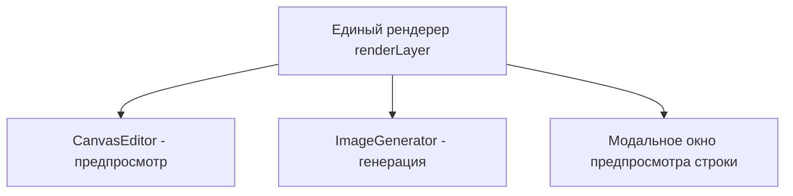
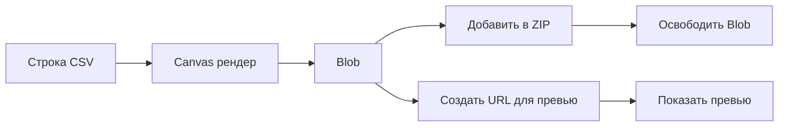
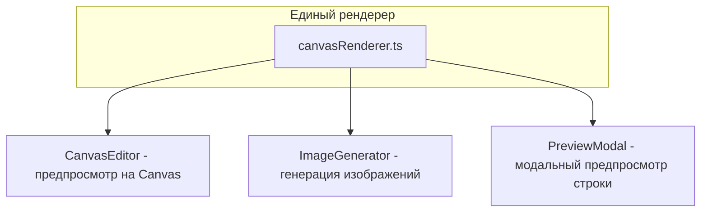

# 🔥 Глубокий аудит приложения «Для Коли»

## Обзор приложения

Генератор изображений с подстановкой текста из CSV данных. Пользователь загружает шаблон-изображение, CSV файл с данными, настраивает текстовые слои (позиция, шрифт, цвет) и генерирует набор изображений — по одному на каждую строку CSV.

---

## 🔴 КРИТИЧЕСКИЕ ПРОБЛЕМЫ (баги и серьёзные UX-проблемы)

### 1. Предпросмотр НЕ совпадает с результатом генерации

**Проблема:** В [`CanvasEditor.tsx`](src/components/CanvasEditor.tsx) слои отображаются как HTML/CSS элементы, а генерация в [`ImageGenerator.tsx`](src/components/ImageGenerator.tsx) использует Canvas 2D API. Это фундаментальное расхождение:

- CSS `word-break: break-word` vs Canvas `wrapWords()` — только посимвольный перенос при длинных словах в CSS, в Canvas слово целиком переносится на следующую строку
- CSS `line-height: 1.3` vs Canvas `fittedSize * 1.3` — разная высота строки
- Рендеринг шрифтов браузером vs Canvas — разная метрика, разный кернинг
- CSS padding `4px 6px` vs Canvas padding `8px` — разное позиционирование текста внутри слоя
- CSS `text-align` с padding vs Canvas `textAlign` с padding — разное выравнивание

**Решение:** Рендерить предпросмотр на Canvas (как при генерации), а не через HTML/CSS. Создать единый `renderLayer()` хелпер, который используется и в предпросмотре, и при генерации. Это гарантирует WYSIWYG.

### 2. Нет предпросмотра с реальными данными CSV

**Проблема:** [`TextLayerComponent.tsx:182`](src/components/TextLayerComponent.tsx:182) показывает `layer.columnName` как текст-заглушку. Пользователь видит «Имя», «Фамилия» вместо «Иван», «Петров». Невозможно оценить как будет выглядеть результат.

**Решение:** Добавить выбор строки CSV для предпросмотра. По умолчанию — первая строка. Пользователь может переключаться между строками для проверки.

### 3. Штрихкод-превью использует захардкоженное значение

**Проблема:** [`TextLayerComponent.tsx:66`](src/components/TextLayerComponent.tsx:66) — `const previewValue = '7693732300000'`. Это фиктивный EAN-13, который не имеет отношения к реальным данным.

**Решение:** Брать значение из первой строки CSV для предпросмотра. Если данных нет — показывать плейсхолдер с сообщением.

### 4. Нет живого предпросмотра отдельной строки перед генерацией

**Проблема:** Пользователь не может увидеть, как будет выглядеть изображение для конкретной строки CSV, пока не сгенерирует ВСЕ изображения. Для 1000 строк это неприемлемо.

**Решение:** Добавить кнопку «Предпросмотр» рядом с каждой строкой в CSV-таблице или селектор строки в панели генерации. Предпросмотр рендерится на Canvas и показывается в модальном окне или inline.

---

## 🟠 СЕРЬЁЗНЫЕ ПРОБЛЕМЫ (UX и производительность)

### 5. Утечка памяти при генерации большого количества изображений

**Проблема:** [`ImageGenerator.tsx:33`](src/components/ImageGenerator.tsx:33) — `blobCache.current` хранит ВСЕ blob-объекты в памяти. Для 1000 изображений по ~500KB = ~500MB RAM. Браузер может упасть.

**Решение:** Хранить только blob URL, а сами blob-объекты высвобождать после создания ZIP. Или генерировать изображения пакетами и сразу добавлять в ZIP без хранения всех в памяти.

### 6. Нет выбора строк для генерации

**Проблема:** Генерируются ВСЕ строки CSV. Нет возможности выбрать диапазон или конкретные строки.

**Решение:** Добавить поля «от строки» и «до строки» в панель генерации. Добавить чекбоксы в CSV-таблице для выбора строк.

### 7. Нет выбора формата и качества выходных изображений

**Проблема:** [`ImageGenerator.tsx:179`](src/components/ImageGenerator.tsx:179) — всегда PNG. Нет выбора JPEG/WebP для меньшего размера файла.

**Решение:** Добавить выбор формата (PNG/JPEG/WebP) и качества (для JPEG/WebP) в панель генерации.

### 8. Имена файлов при скачивании неинформативные

**Проблема:** [`ImageGenerator.tsx:225`](src/components/ImageGenerator.tsx:225) — `generated-${i + 1}.png`. Невозможно понять, какая строка данных в каком файле.

**Решение:** Формировать имя файла из данных CSV. Например: `{columnName1}_{columnName2}_{номер}.png`. Добавить настройку шаблона имени файла.

### 9. Нет предупреждения о несохранённых изменениях

**Проблема:** При нажатии «← Проекты» или «Сбросить» все изменения теряются без предупреждения.

**Решение:** Отслеживать `isDirty` состояние. Показывать подтверждение при уходе с несохранёнными изменениями.

### 10. Слайдеры позиции ограничены 2000px

**Проблема:** [`LayerPanel.tsx:67-68`](src/components/LayerPanel.tsx:67-68) — `max={2000}` для X/Y. Если изображение больше 2000px, нельзя установить позицию через слайдер.

**Решение:** Динамически устанавливать `max` на основе `imageWidth`/`imageHeight`.

### 11. Нет числового ввода для позиции X/Y

**Проблема:** Только слайдеры для X/Y — неточный способ позиционирования. Для пиксель-перфектного выравнивания нужны числовые поля.

**Решение:** Добавить `input[type=number]` рядом со слайдерами или заменить слайдеры на числовые поля с кнопками ±1/±10.

### 12. `fitFontSize` — линейный поиск, медленный для больших объёмов

**Проблема:** [`ImageGenerator.tsx:418`](src/components/ImageGenerator.tsx:418) — цикл `while (size >= MIN_SIZE)` с шагом 1px. Для начального размера 200 и конечного 6 = 194 итерации на каждый слой каждой строки.

**Решение:** Бинарный поиск вместо линейного. Сократит количество итераций с ~200 до ~8.

### 13. `wrapWords` не обрабатывает длинные слова

**Проблема:** [`ImageGenerator.tsx:385`](src/components/ImageGenerator.tsx:385) — если одно слово шире `availWidth`, оно не разбивается. Текст выйдет за границы слоя.

**Решение:** Добавить посимвольный разрыв для слов, которые шире доступной ширины.

### 14. Нет обработки ошибок для отдельных строк

**Проблема:** [`ImageGenerator.tsx:184`](src/components/ImageGenerator.tsx:184) — если `canvas.toBlob()` падает на одной строке, try/catch перехватывает, но генерация продолжается с потенциально некорректным blob. Ошибка одной строки может завалить весь процесс.

**Решение:** Оборачивать рендер каждой строки в отдельный try/catch. При ошибке — генерировать изображение-заглушку с текстом ошибки. Собирать список ошибок и показывать после завершения.

---

## 🟡 УЛУЧШЕНИЯ UI/UX

### 15. Нет управления порядком слоёв (z-order)

**Проблема:** Слои отображаются в порядке создания. Нет возможности изменить порядок, что критично для перекрывающихся слоёв.

**Решение:** Добавить drag-and-drop для изменения порядка в списке слоёв. Добавить кнопки «вверх»/«вниз» в панели свойств.

### 16. Нет удаления/дублирования слоёв

**Проблема:** Нельзя удалить ненужный слой или продублировать существующий с другими настройками.

**Решение:** Добавить кнопки «Удалить» и «Дублировать» в панель свойств слоя.

### 17. Нет видимости/скрытия слоёв

**Проблема:** Нельзя временно скрыть слой для оценки композиции.

**Решение:** Добавить чекбокс видимости (глазик) в список слоёв и панель свойств. Скрытые слои не рендерятся при генерации.

### 18. Нет блокировки слоёв

**Проблема:** Легко случайно сдвинуть настроенный слой при работе с другими.

**Решение:** Добавить иконку замка. Заблокированный слой нельзя перемещать/ресайзить.

### 19. Нет Undo/Redo

**Проблема:** Любое действие необратимо. Случайно сдвинул слой — нет способа вернуть.

**Решение:** Реализовать undo/redo через стек состояний. Ctrl+Z / Ctrl+Shift+Z.

### 20. Нет клавиатурных сокращений

**Проблема:** Нет горячих клавиш для частых действий.

**Решение:**
- `Ctrl+S` — сохранить
- `Ctrl+Z` / `Ctrl+Shift+Z` — undo/redo
- `Delete` — удалить выбранный слой
- `Ctrl+D` — дублировать слой
- Стрелки — сдвинуть слой на 1px (Shift+стрелка — на 10px)
- `Escape` — снять выделение со слоя

### 21. Нет зума и панорамирования холста

**Проблема:** Для больших изображений невозможно рассмотреть детали или увидеть картину целиком.

**Решение:** Добавить зум колесом мыши + Ctrl и панорамирование средней кнопкой / пробел+перетаскивание. Показывать текущий масштаб.

### 22. Позиции новых слоёв накладываются друг на друга

**Проблема:** [`useAppState.ts:73-74`](src/hooks/useAppState.ts:73) — `x: 20 + index * 20, y: 20 + index * 40`. При 5+ слоях они почти полностью перекрывают друг друга.

**Решение:** Распределять слои по сетке или каскадом с достаточным смещением. Учитывать размер изображения.

### 23. Нет валидации файлов при загрузке

**Проблема:** [`FileUploader.tsx`](src/components/FileUploader.tsx) — нет проверки размера файла, нет валидации что загруженный файл действительно изображение.

**Решение:** Добавить лимит размера (например 50MB), проверять что файл читается как изображение, показывать ошибки валидации.

### 24. Нет визуального фидбека при drag-and-drop

**Проблема:** react-dropzone предоставляет `isDragActive`, но он не используется для визуального подсвечивания зоны.

**Решение:** Использовать `isDragActive` для добавления CSS-класса с подсветкой зоны при перетаскивании файла.

### 25. Нет замены загруженного файла

**Проблема:** После загрузки изображения дропзона становится `disabled`. Нельзя заменить файл без полного сброса.

**Решение:** Добавить кнопку «Заменить» рядом с именем загруженного файла.

### 26. Нет подтверждения при сбросе

**Проблема:** Кнопка «Сбросить» в [`App.tsx:228`](src/App.tsx:228) мгновенно удаляет все данные без подтверждения.

**Решение:** Показывать модальное окно подтверждения.

### 27. Нет автосохранения

**Проблема:** Все изменения теряются при закрытии вкладки или краше браузера.

**Решение:** Автосохранение в IndexedDB каждые 30 секунд или при каждом изменении (с debounce).

### 28. Нет уведомлений (toast)

**Проблема:** Сообщения об ошибках и успехе показываются как `console.error` или inline-текст, который легко пропустить.

**Решение:** Добавить toast-уведомления в углу экрана для всех операций: сохранение, ошибки, генерация завершена.

### 29. CSV парсер не определяет разделитель

**Проблема:** [`csvParser.ts`](src/utils/csvParser.ts) — PapaParse по умолчанию использует автоопределение, но не обрабатывает точку с запятой, которая распространена в европейских CSV.

**Решение:** Явно включить `delimiter: 'auto'` в PapaParse или добавить предварительный анализ разделителя.

### 30. Нет предпросмотра загруженного изображения

**Проблема:** После загрузки изображения пользователь видит только имя файла, но не миниатюру.

**Решение:** Показывать миниатюру в FileUploader после загрузки.

---

## 🔵 АРХИТЕКТУРНЫЕ УЛУЧШЕНИЯ

### 31. Разделить рендер-логику в единый модуль

**Проблема:** Логика рендеринга дублируется: CSS-рендер в TextLayerComponent и Canvas-рендер в ImageGenerator. Это источник расхождений.

**Решение:** Создать `src/utils/canvasRenderer.ts` с единой функцией `renderScene(ctx, image, layers, csvRow)`. Использовать её и для предпросмотра, и для генерации.

### 32. Вынести стейт слоёв в useReducer

**Проблема:** [`useAppState.ts`](src/hooks/useAppState.ts) — 12+ `useState` вызовов. Сложно отслеживать взаимосвязи. Для undo/redo нужен reducer.

**Решение:** Реализовать `useReducer` с actions: `MOVE_LAYER`, `RESIZE_LAYER`, `UPDATE_LAYER_PROPS`, `SELECT_LAYER`, `ADD_LAYER`, `DELETE_LAYER`, `DUPLICATE_LAYER`, `REORDER_LAYERS`. Добавить middleware для undo/redo.

### 33. Добавить Error Boundary

**Проблема:** Любая ошибка React-рендера крашит всё приложение.

**Решение:** Обернуть ключевые компоненты в React Error Boundary с дружественным UI восстановления.

### 34. Оптимизировать генерацию — Web Worker

**Проблема:** Генерация изображений выполняется в главном потоке. Для больших объёмов UI зависает.

**Решение:** Вынести Canvas-рендеринг в Web Worker (OffscreenCanvas). Главный поток остаётся отзывчивым.

---

## 📋 ПРИОРИТЕЗИРОВАННЫЙ ПЛАН РЕАЛИЗАЦИИ

### Фаза 1: Критические исправления (WYSIWYG + предпросмотр)

| # | Задача | Файлы |
|---|--------|-------|
| 1 | Создать единый `canvasRenderer.ts` с функцией `renderScene` | новый `src/utils/canvasRenderer.ts` |
| 2 | Переделать `CanvasEditor` — рендерить предпросмотр на Canvas вместо HTML-слоёв | `src/components/CanvasEditor.tsx` |
| 3 | Добавить выбор строки CSV для предпросмотра в CanvasEditor | `src/components/CanvasEditor.tsx`, `src/hooks/useAppState.ts` |
| 4 | Исправить штрихкод-превью — брать значение из CSV данных | `src/components/TextLayerComponent.tsx` или новый Canvas-рендер |
| 5 | Добавить модальный предпросмотр конкретной строки CSV | новый `src/components/RowPreviewModal.tsx` |

### Фаза 2: Управление слоями

| # | Задача | Файлы |
|---|--------|-------|
| 6 | Добавить удаление слоя | `src/components/LayerPanel.tsx`, `src/hooks/useAppState.ts` |
| 7 | Добавить дублирование слоя | `src/components/LayerPanel.tsx`, `src/hooks/useAppState.ts` |
| 8 | Добавить видимость/скрытие слоя | `src/types/index.ts`, `src/components/LayerPanel.tsx` |
| 9 | Добавить блокировку слоя | `src/types/index.ts`, `src/components/LayerPanel.tsx` |
| 10 | Добавить перестановку слоёв (z-order) | `src/components/LayerPanel.tsx`, `src/hooks/useAppState.ts` |
| 11 | Улучшить начальное расположение слоёв | `src/hooks/useAppState.ts` |

### Фаза 3: Генерация изображений

| # | Задача | Файлы |
|---|--------|-------|
| 12 | Бинарный поиск в `fitFontSize` | `src/utils/canvasRenderer.ts` |
| 13 | Посимвольный разрыв длинных слов в `wrapWords` | `src/utils/canvasRenderer.ts` |
| 14 | Выбор формата (PNG/JPEG/WebP) и качества | `src/components/ImageGenerator.tsx` |
| 15 | Выбор диапазона строк для генерации | `src/components/ImageGenerator.tsx` |
| 16 | Информативные имена файлов | `src/components/ImageGenerator.tsx` |
| 17 | Обработка ошибок отдельных строк | `src/components/ImageGenerator.tsx` |
| 18 | Оптимизация памяти — потоковая запись в ZIP | `src/components/ImageGenerator.tsx` |

### Фаза 4: UX улучшения

| # | Задача | Файлы |
|---|--------|-------|
| 19 | Динамический max для слайдеров позиции | `src/components/LayerPanel.tsx` |
| 20 | Числовой ввод для X/Y позиции | `src/components/LayerPanel.tsx` |
| 21 | Подтверждение при сбросе | `src/App.tsx` |
| 22 | Предупреждение о несохранённых изменениях | `src/App.tsx`, `src/hooks/useAppState.ts` |
| 23 | Toast-уведомления | новый `src/components/Toast.tsx` |
| 24 | Визуальный фидбек при drag-and-drop файлов | `src/components/FileUploader.tsx` |
| 25 | Кнопка «Заменить» файл | `src/components/FileUploader.tsx` |
| 26 | Миниатюра загруженного изображения | `src/components/FileUploader.tsx` |
| 27 | Зум и панорамирование холста | `src/components/CanvasEditor.tsx` |

### Фаза 5: Архитектура и производительность

| # | Задача | Файлы |
|---|--------|-------|
| 28 | Рефакторинг useAppState → useReducer | `src/hooks/useAppState.ts` |
| 29 | Undo/Redo | `src/hooks/useAppState.ts` |
| 30 | Клавиатурные сокращения | новый `src/hooks/useKeyboardShortcuts.ts` |
| 31 | Error Boundary | новый `src/components/ErrorBoundary.tsx` |
| 32 | Автосохранение | `src/hooks/useAppState.ts`, `src/utils/projectStorage.ts` |
| 33 | Web Worker для генерации (опционально) | новый `src/workers/imageGenerator.worker.ts` |

---

## 🎯 ИТОГО

- **4 критические проблемы** — предпросмотр не совпадает с результатом, нет предпросмотра с данными
- **10 серьёзных проблем** — память, производительность, отсутствие функционала
- **14 улучшений UI/UX** — управление слоями, горячие клавиши, зум
- **4 архитектурных улучшения** — единый рендерер, reducer, error boundary, web worker
