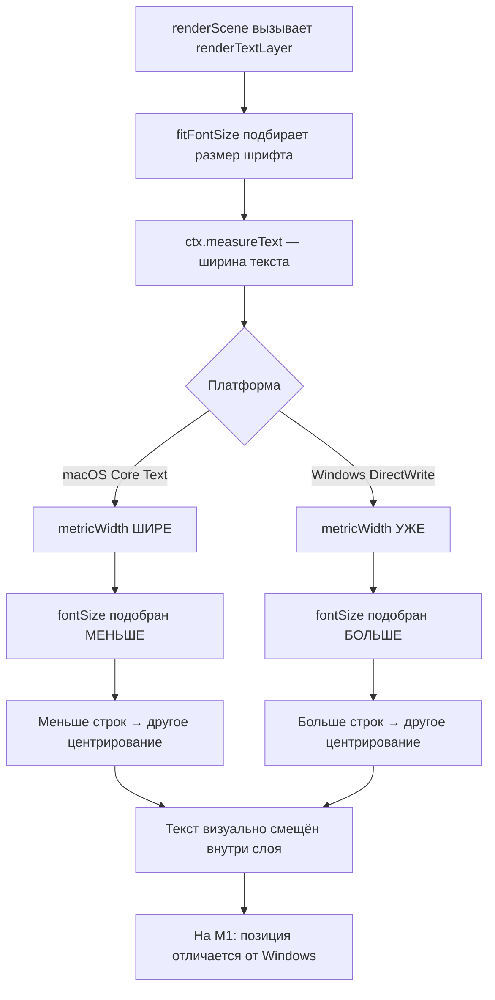

# Анализ: Слет позиционирования элементов на MacBook M1

## Описание проблемы

На ноутбуке Apple MacBook M1 элементы позиционируются неправильно с самого начала — и в предпросмотре, и при генерации. Проблема воспроизводится в обоих браузерах — Safari и Chrome.

---

## Корневая причина: Платформозависимые метрики шрифтов + Retina DPR

Поскольку проблема проявляется **с самого начала** и **в обоих браузерах**, основная причина — не в расхождении предпросмотр/генерация, а в **фундаментальной разнице рендеринга Canvas на macOS vs Windows**.

### 🔴 Критическая причина #1: Платформозависимые метрики шрифтов в Canvas

**Файл:** [`canvasRenderer.ts`](src/utils/canvasRenderer.ts:326) — функция `fitFontSize`

```typescript
ctx.font = buildFontString(fontStyle, mid, fontFamily);
const lines = wrapWords(ctx, text, availW);
const totalH = lines.length * mid * 1.3;
const maxW = lines.reduce((max, l) => Math.max(max, ctx.measureText(l).width), 0);
```

`ctx.measureText` возвращает **разные значения** на разных ОС:
- **macOS M1**: шрифт Arial рендерится через Core Text, метрики **шире**
- **Windows**: Arial через DirectWrite/GDI, метрики **уже**
- **Linux**: Arial может отсутствовать, подставляется DejaVu Sans

Результат: `fitFontSize` на MacBook M1 подбирает **другой размер шрифта**, чем на Windows:
- Иной `fontSize` → иная высота текстового блока
- Иные переносы строк через `wrapWords` → иное количество строк
- Смещается вертикальное центрирование: `startY = layer.y + Math.max(padding, (layer.height - totalTextHeight) / 2)`
- Текст визуально «съезжает» внутри слоя

**Дефолтный шрифт `Arial`** — ключевая проблема. На macOS Arial имеет другие метрики, чем Arial на Windows. Это не баг Canvas, а фундаментальное различие шрифтовых движков.

---

### 🔴 Критическая причина #2: Несогласованность devicePixelRatio между предпросмотром и генерацией

**Файлы:** [`CanvasEditor.tsx`](src/components/CanvasEditor.tsx:112), [`ImageGenerator.tsx`](src/components/ImageGenerator.tsx:121)

MacBook M1 имеет Retina-дисплей с `devicePixelRatio = 2`. Это создаёт расхождение:

| Контекст | canvas.width | Масштаб | Результат |
|---|---|---|---|
| Предпросмотр | `canvasSize.width * dpr` | `ctx.scale dpr → scale display` | Корректно на Retina |
| Генерация | `imageWidth` | без DPR | Корректно для вывода |

При предпросмотре контекст масштабирован через `ctx.scale dpr`, а при генерации — нет. `fitFontSize` вызывает `ctx.measureText`, который работает в текущей системе координат. Результаты `measureText` могут отличаться из-за разного состояния контекста.

---

### 🟡 Средняя причина #3: Sub-pixel координаты на Retina

**Файл:** [`useAppState.ts`](src/hooks/useAppState.ts:261), [`canvasRenderer.ts`](src/utils/canvasRenderer.ts:84)

Координаты слоёв `layer.x`, `layer.y` хранятся как `float`. На Retina-дисплее нецелые координаты приводят к:
- Размытому тексту — браузер антиалиасит на субпиксельном уровне
- Визуальному смещению на 0.5–1 CSS-пиксель — что на 2x Retina = 1–2 физических пикселя

```typescript
// doDrag — результат может быть нецелым числом
const newX = (clientX - dragOffset.x) * scaleX;
const newY = (clientY - dragOffset.y) * scaleY;
```

---

### 🟡 Средняя причина #4: Отсутствие загрузки шрифтов перед рендерингом

**Файл:** [`canvasRenderer.ts`](src/utils/canvasRenderer.ts:143)

Если шрифт не загружен к моменту первого рендера, `measureText` использует fallback-шрифт с другими метриками. На M1 это усугубляется тем, что системные fallback-шрифты отличаются от Windows.

---

### 🟢 Низкая причина #5: Math.floor вместо Math.round

**Файл:** [`CanvasEditor.tsx`](src/components/CanvasEditor.tsx:96)

```typescript
setCanvasSize({ width: Math.floor(width), height: Math.floor(height) });
```

`Math.floor` теряет до 1 пикселя. На Retina 2x это 2 физических пикселя.

---

## Диаграмма: Как метрики шрифтов ломают позиционирование



---

## План исправлений

### Шаг 1: Заменить Arial на веб-шрифт с одинаковыми метриками на всех платформах

**Проблема:** Arial имеет разные метрики на macOS и Windows.

**Решение:**
- Подключить веб-шрифт Inter через Google Fonts или локальный `@font-face` — он имеет одинаковые метрики на всех платформах
- Изменить дефолтный `fontFamily` в [`useAppState.ts`](src/hooks/useAppState.ts:117) с `'Arial'` на `'Inter'`
- Добавить `@font-face` в [`index.css`](src/index.css:59) — переменная `--font-sans` уже ссылается на Inter
- Дождаться `document.fonts.ready` перед первым рендером Canvas

**Файлы для изменения:**
- `src/hooks/useAppState.ts` — дефолтный `fontFamily`
- `src/index.css` — загрузка шрифта Inter
- `src/components/CanvasEditor.tsx` — ожидание загрузки шрифтов
- `src/components/ImageGenerator.tsx` — ожидание загрузки шрифтов

### Шаг 2: Округлять координаты слоёв до целых пикселей

**Проблема:** Sub-pixel координаты вызывают размытие и смещение на Retina.

**Решение:**
- В [`doDrag`](src/hooks/useAppState.ts:261) — `Math.round(newX)`, `Math.round(newY)`
- В [`doResize`](src/hooks/useAppState.ts:304) — округлять `updates.x`, `updates.y`, `updates.width`, `updates.height`
- В [`renderTextLayer`](src/utils/canvasRenderer.ts:157) — `Math.round(startY)`, `Math.round(lineX)`
- В [`handleCsvLoad`](src/hooks/useAppState.ts:106) — округлять начальные координаты слоёв

### Шаг 3: Использовать Math.round вместо Math.floor для размера canvas

**Проблема:** `Math.floor` теряет до 1 пикселя.

**Решение:** Заменить `Math.floor` на `Math.round` в расчёте `canvasSize` в [`CanvasEditor.tsx`](src/components/CanvasEditor.tsx:96).

### Шаг 4: Добавить ожидание загрузки шрифтов перед рендерингом

**Проблема:** Первый рендер может произойти до загрузки шрифта → `measureText` использует fallback.

**Решение:**
- В [`CanvasEditor.tsx`](src/components/CanvasEditor.tsx:105) — добавить проверку `document.fonts.ready` перед рендером
- В [`ImageGenerator.tsx`](src/components/ImageGenerator.tsx:88) — то же самое перед генерацией
- Добавить состояние `fontsLoaded` и рендерить только после загрузки

### Шаг 5: Добавить `ctx.resetTransform` перед рендерингом

**Проблема:** Накопленные трансформации контекста могут влиять на `measureText`.

**Решение:**
- В [`renderScene`](src/utils/canvasRenderer.ts:34) — добавить `ctx.resetTransform()` в начале, если это генерация
- Или передавать флаг `isGeneration` и сбрасывать трансформации

### Шаг 6: Добавить отладочный режим для диагностики на M1

**Решение:** Временный режим, который выводит в консоль:
- Текущий `devicePixelRatio`
- Вычисленный `fittedFontSize` для каждого слоя
- Метрики `measureText` для каждого текста
- Координаты слоёв

---

## Приоритет исправлений

| Приоритет | Исправление | Влияние на M1 | Файлы |
|---|---|---|---|
| 🔴 P0 | Веб-шрифт Inter вместо Arial | Устраняет главную причину — разные метрики | `useAppState.ts`, `index.css`, `CanvasEditor.tsx`, `ImageGenerator.tsx` |
| 🔴 P0 | Округление координат | Устраняет смещение на Retina | `useAppState.ts`, `canvasRenderer.ts` |
| 🟡 P1 | Math.round для canvas size | Уменьшает погрешность | `CanvasEditor.tsx` |
| 🟡 P1 | Ожидание загрузки шрифтов | Устраняет fallback-проблему | `CanvasEditor.tsx`, `ImageGenerator.tsx` |
| 🟢 P2 | resetTransform перед рендером | Гарантирует чистое состояние контекста | `canvasRenderer.ts` |
| 🟢 P2 | Отладочный режим | Упрощает диагностику | `canvasRenderer.ts` |
